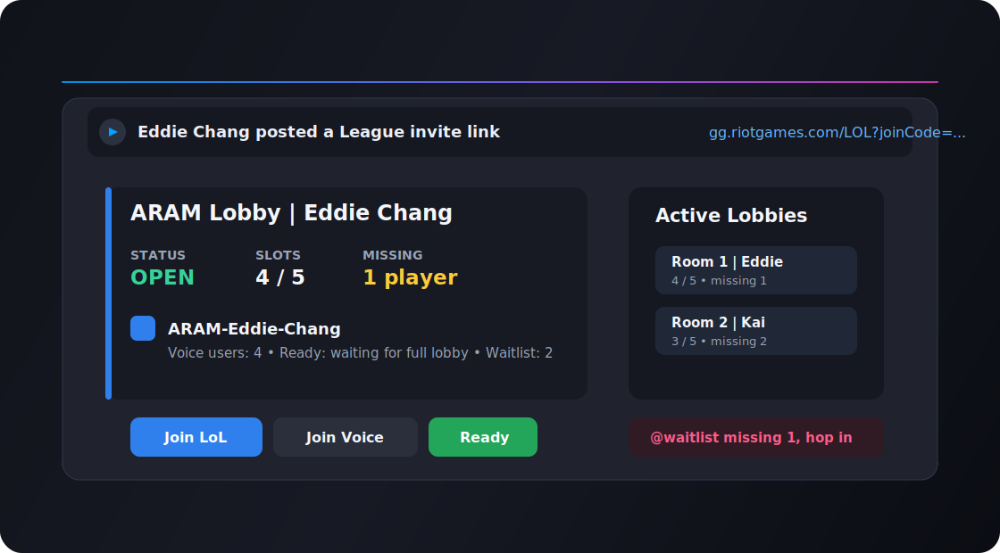
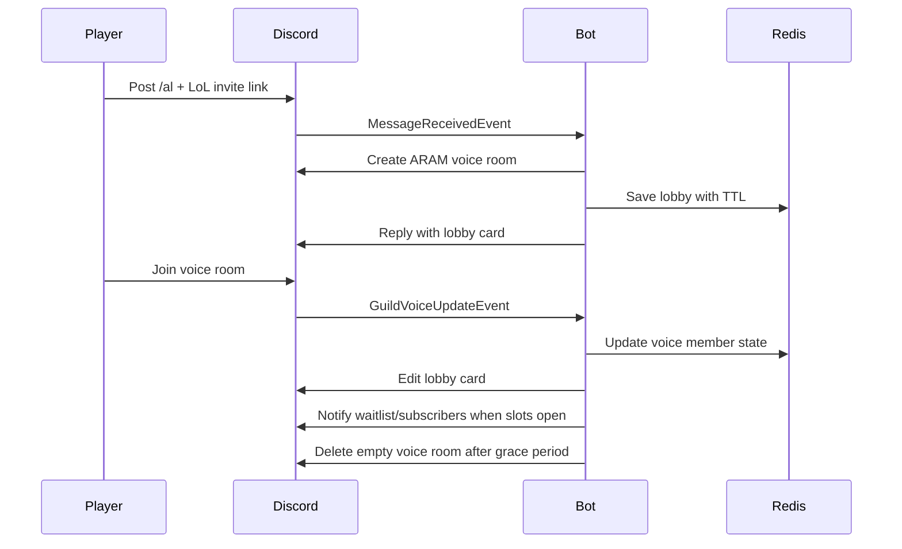

# ARAM Lobby Bot

<p align="center">
  
</p>

<p align="center">
  <strong>A Discord bot that turns League ARAM invite links into trackable voice lobbies.</strong>
</p>

<p align="center">
  
  
  
  
  
</p>

> Unofficial community tool. This project does not call Riot APIs and does not create League rooms.

## Why

ARAM groups often devolve into noisy Discord messages:

```text
++
缺2
滿了
還有缺嗎
```

The Riot join link already gets players into the game. The missing piece is lobby coordination:

- Who opened the lobby?
- Which lobby still needs players?
- Where is the voice room?
- Is the lobby full or closed?

ARAM Lobby Bot solves that one problem: **show the current joinable ARAM lobbies without chat spam.**

## Demo



## Features

| Area | What it does |
| --- | --- |
| Invite detection | Defaults to `/al https://gg.riotgames.com/LOL?joinCode=...` to avoid accidental lobby creation. |
| Voice room automation | Creates a per-lobby voice channel under the configured Discord category. |
| Lobby card | Posts an embed with owner, status, missing slots, voice count, and join buttons. |
| Voice-based capacity | Uses actual voice channel members as the source of truth for `0 / 5` through `5 / 5`. |
| Ready check | Shows Ready/Not Ready controls when the voice room reaches 5 players. |
| Waitlist | Lets non-voice users queue for a full lobby. |
| Vacancy notifications | Mentions waitlisted/subscribed users when a lobby drops to missing 1-2 players. |
| Channel controls | Lets moderators disable detection or switch between prefix mode and raw-link auto mode per text channel. |
| Cleanup | Deletes empty voice rooms after the configured grace period and closes the card. |

## Core Flow



## Tech Stack

- Java 17
- Spring Boot 3
- JDA 5
- Redis
- Docker / Docker Compose

## Quickstart

1. Create a Discord application and bot in the Discord Developer Portal.
2. Enable Message Content Intent in the Discord Developer Portal.
3. Invite the bot to your server with the required permissions below.
4. Start the bot:

```bash
export DISCORD_BOT_TOKEN=your-token
docker compose up --build
```

For local JVM execution, start Redis first and run:

```bash
mvn spring-boot:run
```

## Required Discord Permissions

- Manage Channels
- Create Instant Invite
- View Channels
- Send Messages
- Embed Links
- Use Slash Commands
- Read Message History

The app requests Message Content, Guild Messages, and Guild Voice States gateway intents at runtime.

## Configuration

| Environment variable | Default | Description |
| --- | --- | --- |
| `DISCORD_BOT_TOKEN` | empty | Discord bot token. If empty, the app starts without connecting JDA. |
| `DISCORD_VOICE_CATEGORY_NAME` | `🎮 Voice Category` | Category used for auto-created voice rooms. Created if missing. |
| `ARAM_LOBBY_TTL` | `4h` | Redis TTL for lobby records. |
| `ARAM_CLEANUP_EMPTY_GRACE` | `10s` | How long an empty voice room can remain before deletion. |
| `ARAM_CLEANUP_FIXED_RATE` | `5s` | Cleanup scheduler interval. |
| `ARAM_DETECTION_TRIGGER_PREFIX` | `/al` | Message prefix required in prefix mode. |

## Slash Commands

| Command | Description |
| --- | --- |
| `/aram list` | Show ARAM lobbies with open voice slots. |
| `/aram available` | Alias for `/aram list`. |
| `/aram status` | Show auto-detection status and lobby counts for the current channel. |
| `/aram disable` | Disable LoL invite link auto-detection in the current channel. Requires Manage Channels. |
| `/aram enable` | Enable LoL invite link auto-detection in the current channel. Requires Manage Channels. |
| `/aram mode-prefix` | Require the configured prefix before a LoL invite link. Requires Manage Channels. |
| `/aram mode-auto` | Create lobbies from raw LoL invite links without a prefix. Requires Manage Channels. |
| `/aram notify-on` | Subscribe to vacancy notifications when an ARAM lobby drops to missing 1-2 players. |
| `/aram notify-off` | Unsubscribe from vacancy notifications. |
| `/aram notify-status` | Check whether you are subscribed to vacancy notifications. |
| `/aram close` | Close your latest active lobby. |
| `/aram help` | Show the command list in Discord. |

## Deployment

This bot is a long-running worker process. It needs outbound internet access to Discord, Redis, and a safe place to store `DISCORD_BOT_TOKEN`.

Recommended MVP host: **Railway**.

- Deploys directly from GitHub with the included Dockerfile.
- Redis can run as another service in the same Railway project.
- Service variables can store `DISCORD_BOT_TOKEN` and Redis connection settings.
- The app does not need a public HTTP route because it connects outbound to Discord.

See [Railway deployment guide](docs/deploy-railway.md).

Other viable targets:

| Target | Fit |
| --- | --- |
| Small VPS with Docker | Best control over Redis, logs, and process uptime, but more ops work. |
| Fly.io | Cheap small machines, but Redis usually needs extra setup or an external provider. |
| Render worker | Straightforward, but likely costs more once worker + Redis-compatible Key Value are included. |
| Home lab / NAS with Docker | Good enough for private server testing if uptime is acceptable. |

Avoid serverless request/response platforms because JDA maintains a persistent Discord gateway connection.

## Manual Discord Test Checklist

1. Start the bot with Redis and a valid `DISCORD_BOT_TOKEN`.
2. Post `/al https://gg.riotgames.com/LOL?joinCode=...` in an enabled text channel.
3. Confirm the bot creates a voice room and posts a lobby card with Join LoL and Join Voice buttons.
4. Join and leave the created voice room; confirm the card updates `戰力槽`, `缺人`, and `語音人數`.
5. Put 5 users in the voice room; confirm the card becomes FULL and shows Ready/Not Ready/waitlist buttons.
6. Have a voice user click Ready; confirm Ready Check updates.
7. Have a non-voice user click `排候補`; then drop the voice room from 5 to 4 users and confirm they are mentioned.
8. Run `/aram notify-on` as another user; drop a lobby to missing 1-2 and confirm they are mentioned once for that missing count.
9. Run `/aram mode-auto`, post a raw LoL link, and confirm a lobby is created without `/al`.
10. Run `/aram disable`, post `/al` plus a LoL link, and confirm no lobby is created; run `/aram enable` and retry.
11. Leave the voice room empty for `ARAM_CLEANUP_EMPTY_GRACE`; confirm the voice channel is deleted and the card becomes CLOSED.

## Documentation

- [Technical design](docs/technical-design.md)
- [Railway deployment guide](docs/deploy-railway.md)
- [Manual test checklist](#manual-discord-test-checklist)

## Scope Boundaries

Included:

- LoL invite link detection
- Discord voice room lifecycle
- Lobby card state
- Missing-player visibility
- Voice room cleanup

Not included:

- Riot API integration
- League room creation
- MySQL persistence
- Player ranking or statistics
- Riot account binding
