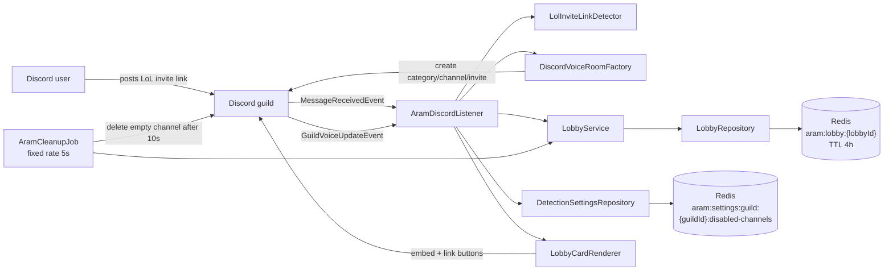
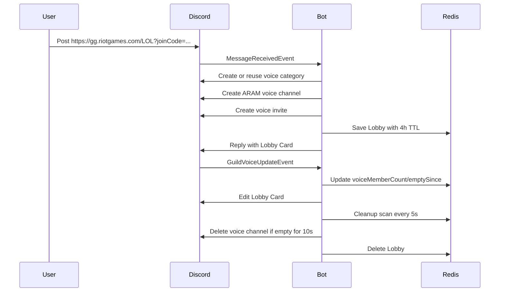

# ARAM Lobby Bot Technical Design

## Goal

Solve one Discord coordination problem: "which ARAM lobby still needs players?"

The bot does not create League rooms, call Riot APIs, persist to MySQL, rank players, or bind Riot accounts.

## Architecture

## Runtime Flow

## Components

| Component | Responsibility |
| --- | --- |
| `LolInviteLinkDetector` | Extract the first Riot join link from a Discord message. |
| `AramDiscordListener` | Thin JDA adapter for messages, slash commands, and voice updates. |
| `DiscordVoiceRoomFactory` | Find/create voice category and create per-lobby voice channels. |
| `LobbyService` | Own lobby state transitions: create, full, close, voice presence, cleanup eligibility. |
| `RedisLobbyRepository` | Persist lobby JSON under `aram:lobby:{lobbyId}` with a 4-hour TTL. |
| `RedisDetectionSettingsRepository` | Persist per-guild disabled text channels for LoL invite auto-detection. |
| `LobbyCardRenderer` | Render Discord embeds and buttons from current lobby state. |
| `AramCleanupJob` | Periodically delete empty voice rooms and remove Redis lobby records. |

## Data Model

`Lobby` stores the requested fields plus Discord card metadata needed for updates:

- `lobbyId`
- `ownerUserId`
- `ownerDisplayName`
- `sourceMessageId`
- `cardMessageId`
- `textChannelId`
- `riotJoinLink`
- `voiceChannelId`
- `voiceChannelName`
- `voiceInviteLink`
- `joinedUsers`
- `voiceMemberCount`
- `status`
- `createdAt`
- `voiceEmptySince`
- `closedAt`

## Reliability Notes

- Player count, missing count, and full/open status use the actual voice channel member count as the source of truth.
- Invite link auto-detection can be disabled per text channel and is persisted in Redis.
- The current MVP assumes one bot instance.
- Cleanup deletes Redis only after a Discord channel delete succeeds. Missing voice channels are treated as stale and closed.
- If `DISCORD_BOT_TOKEN` is absent, the Spring app starts without connecting JDA. This keeps tests and local bootstrapping simple.
- Slash commands are registered globally, so Discord propagation can take time.

## Test Coverage

Covered by unit tests:

- Riot invite link detection, including messages without links and trailing punctuation.
- Lobby creation with owner counted as first player.
- Voice presence drives full/open status and missing-player counts.
- Closed lobby cards render disabled LoL and voice link buttons.
- Close removes lobby from active/open query results.
- Voice empty timer and cleanup grace-period logic.
- Redis key namespace and save/find JSON behavior with TTL.

Not covered by automated tests yet:

- End-to-end JDA behavior against a real Discord guild.
- Real Redis connectivity and Redis SCAN behavior.
- Discord permission failure paths.

For MVP, the highest-value manual validation is in a private Discord server with a real bot token and Redis.
